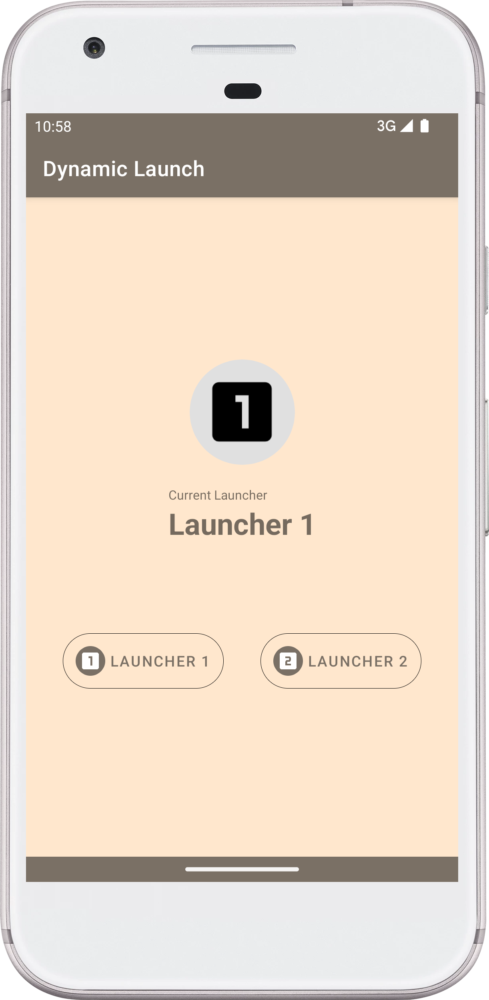
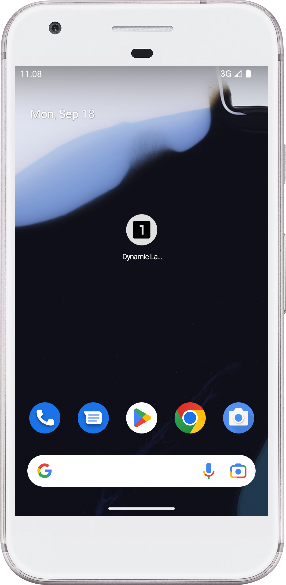

# Dynamic-Launcher-Icon
Sample app for setting different app launcher icon dynamically. In the below image you can see we have two option to choose launcher icon. You can click anyone to change app icon.

  

## Screen UI

